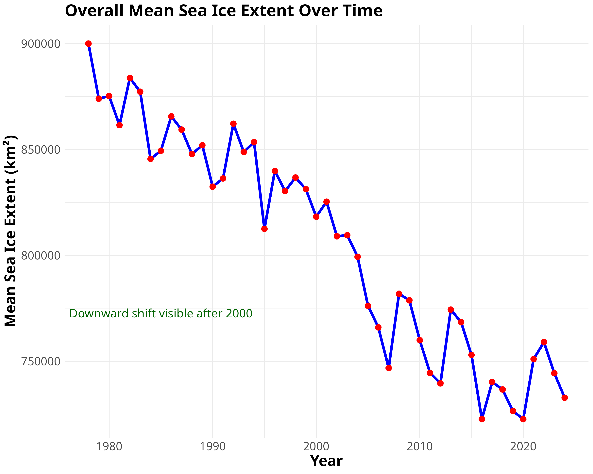
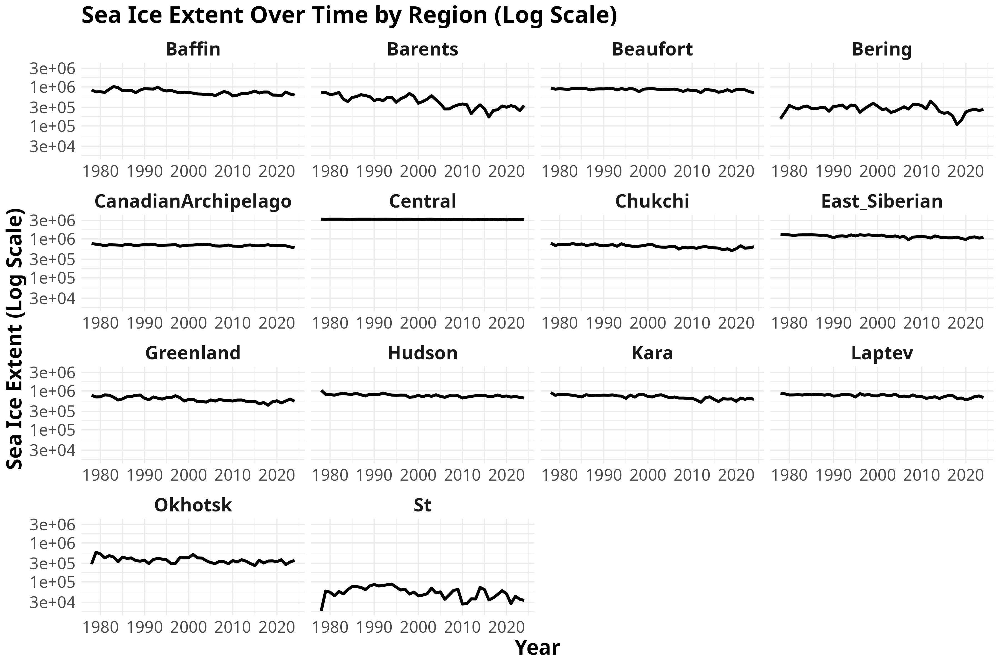

# Bayesian Hierarchical Modeling of Arctic Sea Ice Extent

## 🌍 Overview
This project investigates the temporal and regional variability of **Arctic sea ice extent** using **Bayesian hierarchical modeling**. We compare two models:
1. A **Bayesian Hierarchical Non-Autoregressive model (No-AR)** that assumes independent residuals.
2. An **Bayesian Hierarchical Autoregressive model (AR(1))**, which captures temporal dependence in residuals.

Using data from the **[National Snow and Ice Data Center (NSIDC)](https://noaadata.apps.nsidc.org/NOAA/G02135/north/)**, we assess whether accounting for temporal correlation improves predictive performance. The findings provide insights into the declining trends in sea ice extent and highlight key regional differences.

---

## 📊 Key Findings
- **Temporal Trends**: The AR(1) model significantly improves predictive performance by capturing year-to-year dependencies in sea ice extent.
- **Regional Variability**: Different Arctic regions exhibit varying rates of sea ice decline, with some regions more stable while others show rapid reduction.
- **Model Performance**: Leave-one-out cross-validation (LOO) revealed that the AR(1) model achieved an **ELPD improvement of 73.3 units (SE = 27.6)** over the No-AR model, indicating a meaningful enhancement in predictive accuracy.

---

## 📌 Methodology
### **1️⃣ Data Processing**
- Data from **NSIDC**: Monthly sea ice extent for 14 Arctic regions (1979–2023)
- Preprocessing: Aggregated to annual means, log-transformed for stability
- **Exploratory Analysis**: Distribution analysis, time series trends, regional comparisons

### **2️⃣ Bayesian Hierarchical Models**
#### **📌 Model 1: Bayesian Hierarchical Non-Autoregressive (No-AR)**
- Hierarchical model with region-specific intercepts
- Assumes independent residuals across time
- Captures inter-regional differences but ignores temporal dependencies

#### **📌 Model 2: Bayesian Hierarchical Autoregressive AR(1)**
- Extends No-AR by introducing an **AR(1) structure** in residuals
- Models year-to-year correlation, accounting for persistence in sea ice dynamics

### **3️⃣ Model Comparison & Evaluation**
- **Convergence Diagnostics**: Effective sample size (ESS), R-hat, trace plots
- **Predictive Performance**: Leave-One-Out Cross-Validation (LOO)
- **Statistical Interpretation**: Posterior distributions, credible intervals, and regional trends

---

## 🔥 Results & Visualizations
### **📌 Overall Sea Ice Decline**

📌 The figure above shows a significant **downward shift in sea ice extent after 2000**, highlighting the increasing impact of climate change.

### **📌 Regional Variability in Sea Ice Extent**

📌 Different Arctic regions exhibit unique trends. Some show **gradual decline**, while others remain relatively stable.

### **📌 Model Comparison: Leave-One-Out Cross-Validation (LOO)**
| Model       | ELPD Difference | SE Difference |
|------------|---------------|--------------|
| **AR(1)**  | **0.0**       | **0.0**       |
| **No-AR**  | -73.3         | 27.6         |
📌 The AR(1) model outperforms the No-AR model by a significant margin, indicating that **temporal correlation is a key factor in predictive accuracy**.

---

## **🚀 Installation & Usage Guide**

```bash
git clone https://github.com/r-a-j/Applied-Bayesian-Data-Analysis.git
cd Applied-Bayesian-Data-Analysis

```

### **📌 Requirements**

Ensure you have the required dependencies installed before running the analysis.

#### **🔹 For R:**

Run the following command in the **R console** to install required packages:

```r
source("r_requirements.R")

```

#### **🔹 For Python (pip users):**

Run in the **terminal**:

```sh
pip install -r requirements.txt

```

#### **🔹 For Python (Conda users):**

If you prefer **Conda**, set up the environment with:

```sh
conda env create -f environment.yml
conda activate sea_ice_analysis

```

----------

### **📌 Running the Analysis**

Once dependencies are installed, execute the analysis steps in order:

1️⃣ **Run Data Preprocessing**

```bash
jupyter nbconvert --execute --inplace preprocess.ipynb

```

2️⃣ **Perform Exploratory Data Analysis (EDA)**

```r
rmarkdown::render("exploratory_data_analysis.Rmd")

```

3️⃣ **Fit Hierarchical Bayesian Models with Normal Priors**

```r
source("analysis_normal_priors.R")

```

4️⃣ **Fit Hierarchical Bayesian Models with Alternative Priors**

```r
source("analysis_alternative_priors.R")

```

----------

### **💡 Notes:**

-   Ensure that **R and Python are installed** before running the commands.
-   **For R users:** The `r_requirements.R` script automatically installs missing packages.
-   **For Jupyter Notebook users:** Ensure you have `nbconvert` installed for running `.ipynb` files from the terminal.

---

## 📌 Future Work
- **Higher temporal resolution**: Extending the model to monthly/seasonal data.

- **Additional climate variables**: Including sea surface temperature, atmospheric pressure indices.

- **Non-linear modeling**: Exploring Gaussian processes and splines for improved flexibility.

- **Refined LOO estimates**: Using moment matching for more precise model comparisons.

---
## 📜 Citation
If you use this work, please cite:

```bibtex
@misc{nsidc,
  author       = {{National Snow and Ice Data Center}},
  title        = {National Snow and Ice Data Center},
  year         = {2025},
  url          = {https://nsidc.org/}  
}

@dataset{sea_ice_index,
  author       = {Fetterer, Florence and Knowles, Kristen and Meier, Walter and Savoie, Mark},
  title        = {Sea Ice Index, Version 3},
  year         = {2002},
  version      = {3},
  url          = {https://nsidc.org/data/g02135/versions/3},
  note         = {[Dataset]},
}

@book{Gelman2013,
  title={Bayesian Data Analysis, 3rd Edition},
  author={Gelman, A. and Carlin, J. B. and Stern, H. S. and Dunson, D. B. and Vehtari, A. and Rubin, D. B.},
  year={2013},
  publisher={CRC Press}
}

@article{Buerkner2017,
  title={brms: An R Package for Bayesian Multilevel Models Using Stan},
  author={B{\"u}rkner, Paul-Christian},
  journal={Journal of Statistical Software},
  volume={80},
  number={1},
  year={2017},
  pages={1--28}
}

@article{Vehtari2017,
  title={Practical Bayesian model evaluation using leave-one-out cross-validation and WAIC},
  author={Vehtari, A. and Gelman, A. and Gabry, J.},
  journal={Statistics and Computing},
  volume={27},
  number={5},
  pages={1413--1432},
  year={2017}
}

@misc{Stan2023,
  title={Stan: A C++ library for probability and sampling},
  howpublished={\url{http://mc-stan.org}},
  note={Accessed 2023},
  year={2023}
}

@manual{Dowle2019,
  title       = {{data.table}: Extension of `data.frame`},
  author      = {Dowle, Matt and Srinivasan, Arun},
  year        = {2019},
  howpublished= {\url{https://CRAN.R-project.org/package=data.table}},
  note        = {R package version 1.12.8},
}

@manual{Wickham2016,
  title       = {{ggplot2}: Elegant Graphics for Data Analysis},
  author      = {Wickham, Hadley},
  year        = {2016},
  publisher   = {Springer-Verlag},
  address     = {New York},
}

@article{Buerkner2017,
  title   = {brms: An R package for Bayesian multilevel models using Stan},
  author  = {B{\"u}rkner, Paul-Christian},
  journal = {Journal of Statistical Software},
  volume  = {80},
  number  = {1},
  pages   = {1--28},
  year    = {2017}
}

@misc{Stan2023,
  title        = {{Stan}: A {C++} Library for Probability and Sampling},
  howpublished = {\url{https://mc-stan.org}},
  note         = {Accessed 2023},
  year         = {2023}
}

@book{Gelman2013,
  title     = {{Bayesian Data Analysis, 3rd Edition}},
  author    = {Gelman, Andrew and Carlin, John B. and Stern, Hal S. and Dunson, David B. and Vehtari, Aki and Rubin, Donald B.},
  publisher = {CRC Press},
  year      = {2013}
}

@manual{Python,
  title       = {Python: A dynamic object-oriented programming language},
  author      = {Van Rossum, Guido and Drake Jr, Fred L.},
  howpublished= {\url{https://www.python.org}},
  note        = {Accessed 2023}
}

@manual{Pandas,
  title       = {pandas: Python Data Analysis Library},
  author      = {McKinney, Wes and contributors},
  howpublished= {\url{https://pandas.pydata.org}},
  note        = {Accessed 2023}
}

@manual{Tidyr,
  title       = {tidyr: Tidy Messy Data},
  author      = {Wickham, Hadley},
  howpublished= {\url{https://CRAN.R-project.org/package=tidyr}},
  note        = {Accessed 2023},
  year        = {2023}
}

@book{feynman1963lnphysics,
  title={The Feynman lectures on physics},
  author={Feynman, R.P. and Leighton, R.B. and Sands, M.L.},
  edition={1},
  isbn={9780201021165},
  year={1963},
  publisher={Addison-Wesley}
}

@book{mcelreath2016statistical,
  title={Statistical Rethinking: A Bayesian Course with Examples in R and Stan},
  author={Richard McElreath},
  isbn={9781482253443},
  year={2016},
  publisher={CRC Press\slash Taylor \& Francis Group}
}


@book{shumway2017time,
  author    = {Shumway, Robert H. and Stoffer, David S.},
  title     = {Time Series Analysis and Its Applications: With R Examples},
  publisher = {Springer},
  year      = {2017},
  edition   = {4th}
}

@book{gelman2013bayesian,
  author    = {Gelman, Andrew and Carlin, John B. and Stern, Hal S. and Dunson, David B. and Vehtari, Aki and Rubin, Donald B.},
  title     = {Bayesian Data Analysis},
  publisher = {CRC Press},
  year      = {2013},
  edition   = {3rd}
}

@book{robert2004monte,
  author    = {Robert, Christian and Casella, George},
  title     = {Monte Carlo Statistical Methods},
  publisher = {Springer},
  year      = {2004}
}

@book{cressie2011statistics,
  author    = {Cressie, Noel and Wikle, Christopher K.},
  title     = {Statistics for Spatio-Temporal Data},
  publisher = {Wiley},
  year      = {2011}
}
```

---

## 📬 Contact
For any questions or collaboration inquiries, feel free to reach out:
📧 Email: er.rajpawar@gmail.com  
🔗 GitHub: [r-a-j](https://github.com/r-a-j)